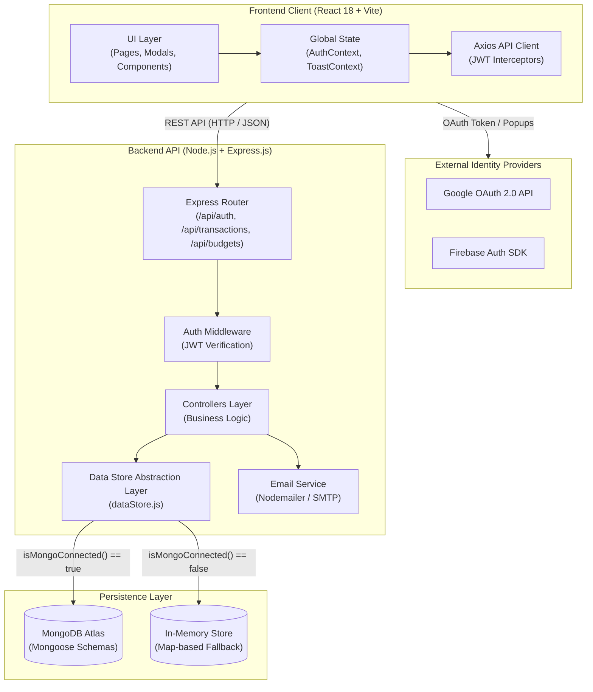
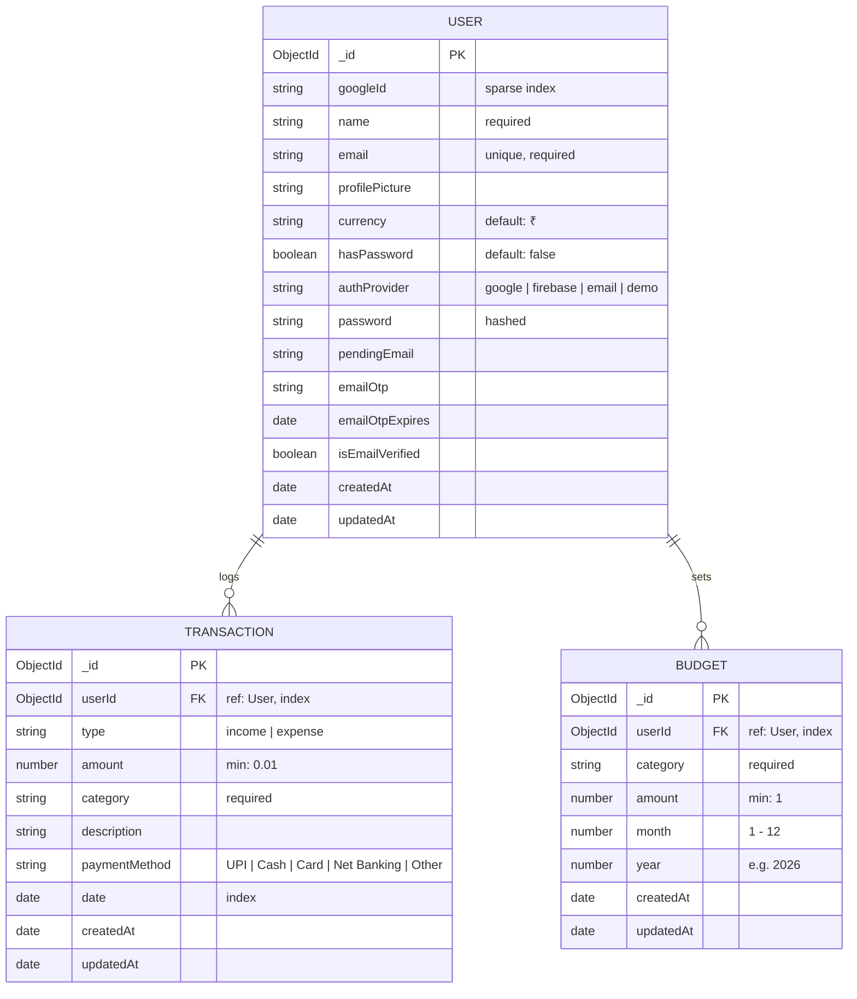

# System Architecture & Technical Specifications — ExpenseX 🏗️

## 1. High-Level System Architecture

ExpenseX is built on a modern decoupled Client-Server architecture. The frontend is a React 18 Single Page Application (SPA) powered by Vite and Tailwind CSS. The backend is a modular Node.js / Express.js REST API featuring a hybrid persistence layer (MongoDB Atlas with in-memory fallback) and multi-provider authentication.



---

## 2. Frontend Architecture (`client/`)

The client is optimized for rapid rendering, clean separation of concerns, and fluid micro-interactions.

### 2.1 Technology Stack
- **Framework**: React 18 (`react`, `react-dom`)
- **Build Tool**: Vite 5 (`@vitejs/plugin-react`)
- **Routing**: React Router DOM v6 (`BrowserRouter`, `Routes`, `Route`, `Navigate`, `Outlet`)
- **Styling**: Tailwind CSS v3 with PostCSS and custom dark-theme glassmorphism utility classes
- **Icons**: Lucide React (`lucide-react`)
- **Charts**: Recharts (`recharts` — `ResponsiveContainer`, `BarChart`, `PieChart`)
- **HTTP Client**: Axios (`axios` with request/response interceptors)
- **Authentication SDK**: Firebase v12 (`firebase/auth`)

### 2.2 Directory Structure
```text
client/src/
├── assets/             # Static logos, graphics
├── components/         # Reusable modular UI components
│   ├── AvatarBasketModal.jsx   # Curated avatar gallery picker & custom image URL
│   ├── BudgetModal.jsx         # Monthly category budget creation/edit modal
│   ├── ConfirmModal.jsx        # Generic confirmation dialogs
│   ├── DeleteAuthModal.jsx     # Security re-authentication modal for deletions
│   ├── EditProfileModal.jsx    # Profile details & email OTP verification modal
│   ├── Loader.jsx              # Bespoke branded ExpenseX CSS loader
│   ├── Navbar.jsx              # Top app navigation bar, quick add, user menu
│   ├── ProtectedRoute.jsx      # Route guard redirecting unauthenticated users
│   ├── SetPasswordModal.jsx    # Master password setup dialog for OAuth users
│   ├── Sidebar.jsx             # Responsive drawer / desktop sidebar navigation
│   └── TransactionModal.jsx    # Income/Expense entry & editing modal
├── config/
│   └── firebase.js     # Firebase client app & Google Auth provider initialization
├── constants/
│   └── avatars.js      # Curated avatar catalog (Vehicles, Animals, Humans, Tech)
├── context/
│   ├── AuthContext.jsx # Global user authentication, token storage, profile updates
│   └── ToastContext.jsx# Global toast notification management system
├── pages/
│   ├── Budgets.jsx     # Monthly budget planning, progress tracking, over-limit alerts
│   ├── Dashboard.jsx   # Financial KPI summary, recent transactions, charts
│   ├── Login.jsx       # Firebase Google sign-in & email credentials login
│   ├── Reports.jsx     # Analytics, savings rate KPI, cash flow & payment methods
│   ├── Settings.jsx    # Currency preference, profile, avatar, master password
│   ├── Signup.jsx      # New account registration page
│   └── Transactions.jsx# Full transaction ledger with search, category & date filters
├── services/
│   └── api.js          # Centralized Axios instance with JWT interceptors
├── utils/
│   ├── categories.js   # Unified category definitions for income & expense
│   └── currency.js     # Multi-currency symbols and formatting helpers
├── App.jsx             # Main router configuration & global layout shell
├── index.css           # Tailwind base styles, glassmorphism tokens, custom animations
└── main.jsx            # React root mount point
```

### 2.3 Global State Management
- **`AuthContext`**:
  - Rehydrates user state and token from `localStorage` on initial boot.
  - Manages `user`, `token`, `loading`, and `isAuthenticated`.
  - Exposes authentication methods: `loginWithGoogle`, `loginWithFirebase`, `logout`, `updateCurrency`, `updateProfile`, `setAccountPassword`, `sendEmailOtp`, `verifyEmailOtp`.
- **`ToastContext`**:
  - Renders custom floating notifications (success, error, warning, info) with smooth progress-bar countdowns.
- **Event-Driven UI Refresh**:
  - Transaction creations dispatch a global window event (`expensex:transaction-added`) to synchronize data across disparate route views without forcing full-page reloads.

---

## 3. Backend Architecture (`server/`)

The backend follows an idiomatic modular Express.js pattern using standard ES Modules (`type: "module"`).

### 3.1 Technology Stack
- **Runtime**: Node.js (v18+)
- **Web Framework**: Express.js (`express`)
- **Database ODM**: Mongoose (`mongoose`)
- **Security & Tokens**: JSON Web Tokens (`jsonwebtoken`), Google Auth Library (`google-auth-library`)
- **Mailing**: Nodemailer (`nodemailer`)
- **Utility & Logging**: Morgan (`morgan`), CORS (`cors`), Dotenv (`dotenv`)

### 3.2 Directory Structure
```text
server/src/
├── config/
│   └── db.js               # MongoDB connection lifecycle & event listeners
├── controllers/
│   ├── authController.js   # Authentication, profile, OTP verification, password handlers
│   ├── budgetController.js # Budget CRUD and monthly allocation calculations
│   └── transactionController.js # Transaction CRUD, multi-filter queries, summary aggregation
├── middleware/
│   ├── authMiddleware.js   # JWT verification & `req.user` rehydration
│   └── errorMiddleware.js  # Standardized 404 and 500 error response handlers
├── models/
│   ├── Budget.js           # Mongoose budget schema with compound unique index
│   ├── Transaction.js      # Mongoose transaction schema with compound indexes
│   └── User.js             # Mongoose user schema with authentication metadata
├── routes/
│   ├── authRoutes.js       # Endpoints for authentication, profile, OTP, password
│   ├── budgetRoutes.js     # Endpoints for monthly budgets
│   ├── healthRoutes.js     # Endpoints for server and DB status health checks
│   └── transactionRoutes.js# Endpoints for transaction CRUD and analytics summaries
├── services/
│   ├── dataStore.js        # Hybrid persistence engine (MongoDB + In-Memory fallback)
│   ├── emailService.js     # Nodemailer email generation and OTP transport
│   └── googleAuth.js       # Google OAuth ID token verification via google-auth-library
└── server.js               # Main Express application initialization & middleware stack
```

---

## 4. Database Architecture & Data Models

### 4.1 Entity Relationship Diagram (ERD)



### 4.2 Database Indexes & Constraints
- **User Collection**:
  - `email`: Unique index (`{ unique: true, lowercase: true }`).
  - `googleId`: Sparse index for fast OAuth lookups without colliding on null values.
- **Transaction Collection**:
  - `userId`: Standard index for user isolation.
  - `{ userId: 1, date: -1 }`: Compound index optimizing chronological queries and date-filtered views.
- **Budget Collection**:
  - `{ userId: 1, category: 1, month: 1, year: 1 }`: Unique compound index ensuring a user can have only one budget per category in a specific month and year.

---

## 5. Intelligent Hybrid Persistence Strategy (`dataStore.js`)

To guarantee zero-friction onboarding, local development resilience, and continuous testing capability, ExpenseX features an intelligent abstraction layer in `server/src/services/dataStore.js`.

1. **Active Atlas Mode**: When `MONGO_URI` is valid and `mongoose.connection.readyState === 1`, all operations delegate directly to native Mongoose ODM models (`User`, `Transaction`, `Budget`).
2. **In-Memory Fallback Mode**: If MongoDB is disconnected or unconfigured, the system automatically redirects operations to internal `Map` collections:
   - `memUsers`: Stores user objects keyed by `_id`.
   - `memTransactions`: Stores transaction objects keyed by `_id`.
   - `memBudgets`: Stores budget objects keyed by `_id`.
3. **Automatic Sample Data Seeding**: When a user registers or logs in while running in memory mode, `seedSampleData(userId)` automatically generates a realistic initial financial profile (salary income, dining, groceries, transport, utilities, and budgets) to enable immediate exploration.

---

## 6. Authentication & Security Architecture

### 6.1 Authentication Flows
1. **Google OAuth 2.0**:
   - Client obtains credential token via Google OAuth or Firebase Google Sign-In.
   - Token sent to `POST /api/auth/google` or `POST /api/auth/firebase`.
   - Backend validates the token via `google-auth-library` or payload signature.
   - User account created or synchronized in data store.
   - 30-day HMAC-SHA256 JWT generated and returned.
2. **Firebase Auth (Email / Password)**:
   - Client signs in with Firebase Client SDK.
   - Sends user identity and provider information to `POST /api/auth/firebase`.
   - Backend links account and returns standard ExpenseX JWT.

### 6.2 Security Guardrails
- **Master Password Prompt**: OAuth users lacking a password receive non-intrusive modal prompts (`SetPasswordModal.jsx`) allowing them to establish a master password.
- **Critical Action Verification (`DeleteAuthModal.jsx`)**:
  - Deleting financial records is a high-impact operation.
  - The client prompts for user password re-authentication or Google OAuth re-authentication before dispatching `DELETE /api/transactions/:id`.
- **Two-Step Email Modification with OTP**:
  - When updating email address in `Settings`:
    1. User enters new email; client requests `POST /api/auth/send-email-otp`.
    2. Server generates a cryptographically random 6-digit numeric code with 10-minute expiry and dispatches it via Nodemailer (`emailService.js`).
    3. User inputs the 6-digit code via `POST /api/auth/verify-email-otp`.
    4. Upon validation, the email address is safely updated in the database.

---

## 7. REST API Endpoints Specification

| Method | Endpoint | Access | Description |
| :--- | :--- | :--- | :--- |
| **GET** | `/api/health` | Public | Returns server health, environment, and MongoDB connection status |
| **POST** | `/api/auth/google` | Public | Authenticates Google credential token & issues JWT |
| **POST** | `/api/auth/firebase` | Public | Authenticates Firebase user credential & issues JWT |
| **GET** | `/api/auth/me` | Private | Retrieves currently authenticated user profile |
| **PUT** | `/api/auth/profile` | Private | Updates name, profile picture, or verified email |
| **PUT** | `/api/auth/currency` | Private | Updates user's preferred currency symbol |
| **PUT** | `/api/auth/set-password` | Private | Sets or updates master account password |
| **POST** | `/api/auth/send-email-otp` | Private | Generates and emails 6-digit verification OTP |
| **POST** | `/api/auth/verify-email-otp`| Private | Validates 6-digit OTP for pending email change |
| **GET** | `/api/transactions` | Private | Fetches transactions with type, category, search, and date filters |
| **POST** | `/api/transactions` | Private | Creates a new income or expense transaction |
| **GET** | `/api/transactions/summary`| Private | Returns aggregate financial KPI metrics, charts data, and trends |
| **PUT** | `/api/transactions/:id` | Private | Updates an existing transaction |
| **DELETE**| `/api/transactions/:id` | Private | Deletes a transaction |
| **GET** | `/api/budgets` | Private | Returns budgets for specified month and year with spending totals |
| **POST** | `/api/budgets` | Private | Creates or updates a monthly category budget limit |
| **DELETE**| `/api/budgets/:id` | Private | Deletes a monthly budget limit |
